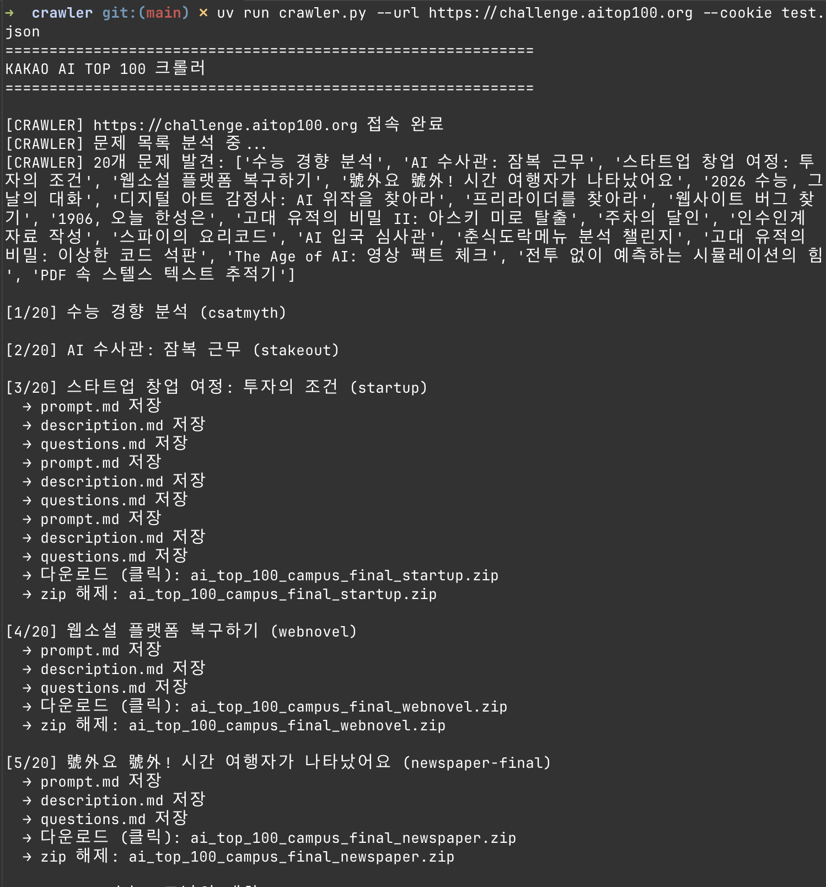

# KAKAO AI TOP 100 Crawler

> Component of **KAKAO Roastery Orchestra**

**Language:** [🇰🇷 한국어](./README.md) | [🇺🇸 English](../docs/en/crawler.md)

AI 경진대회 사이트의 문제 정보(설명, 문항, 첨부파일)를 자동 수집하는 크롤러.
LLM(GPT)이 사이트 구조를 분석해 문제 페이지 콘텐츠를 추출하고
`../workspace/{slug}/problem/` 에 저장한다.

## 1. 요구사항

- Python 3.9+
- [uv](https://github.com/astral-sh/uv) 패키지 매니저
- OpenAI API 키
- Chromium (Playwright가 자동 설치)

## 2. 설치

```bash
# 프로젝트 루트 → crawler 디렉토리로 이동
cd {PROJECT_ROOT}/crawler

# 가상환경 생성 + 의존성 설치 (uv가 자동 처리)
uv sync

# 또는 requirements.txt 사용
uv pip install -r requirements.txt

# Playwright 브라우저 바이너리 설치
uv run playwright install chromium
```

## 3. 환경변수

`.env` 파일을 crawler 디렉토리에 생성:

```
OPENAI_API_KEY=sk-...
```

| 변수 | 기본값 | 설명 |
|---|---|---|
| `OPENAI_API_KEY` | (필수) | OpenAI API 키 |
| `LLM_MODEL` | `gpt-5.3-chat-latest` | 사용할 LLM 모델 ID |
| `CRAWL_SITE_URL` | `https://challenge.aitop100.org` | 크롤링 대상 사이트 |
| `CRAWL_CONCURRENCY` | `3` | 동시 크롤링 문제 수 |

## 4. 인증 파일 준비

로그인 정보를 JSON 파일로 준비. 두 형식 지원:

### 형식 A — localStorage (JWT 토큰)

```json
{
    "aitop_tokens": {
        "access_token": "{YOUR_TOKEN}",
        "refresh_token": "{YOUR_TOKEN}"
    }
}
```

## 5. 실행

```bash
uv run crawler.py --url <사이트_주소> --cookie <인증_파일.json>
```

### 예시

```bash
uv run crawler.py \
  --url https://challenge.aitop100.org \
  --cookie test.json
```



## 6. 출력 구조

문제별로 프로젝트 루트의 `workspace/` 디렉토리에 저장:

```
PROJECT_ROOT/
├── crawler/                       # 본 크롤러
└── workspace/                     # 출력 위치
    └── {slug}/
        ├── prompt.md              # Orchestrator 시작 프롬프트
        └── problem/
            ├── description.md     # 문제 설명, 유의사항, 채점 
            ├── description1.png   # 본문 이미지 (있을 경우)
            ├── questions.md       # 문항 목록, 선지, 배점
            └── files/             # 첨부 파일 (zip 자동 압축 해제)
```

## 7. 동작 흐름

1. `--url` 사이트에 Chromium 브라우저(headful)로 접속
2. `--cookie` 파일의 인증 정보 주입 (localStorage 또는 쿠키)
3. LLM이 현재 페이지에서 문제 목록(이름 + URL + slug) 추출
4. 각 문제 페이지를 최대 `CRAWL_CONCURRENCY`개 동시 탭으로 크롤링
   - 문제 설명 / 유의사항 / 채점 기준
   - 문항 및 선지
   - 본문 이미지 (`description1.png`, …)
   - 첨부파일 (zip 자동 해제, ZIP Slip 차단)
5. 결과를 `../workspace/{slug}/` 에 저장
6. 성공 / 실패 목록 + `workspace/crawl_log.txt` 기록

## 8. 주의사항

- 실행 전 사이트 로그인된 토큰을 `--cookie` 파일에 준비할 것
- `CRAWL_CONCURRENCY` 과도 시 차단 위험 → 기본값(3) 권장
- 출력 경로는 `../workspace`로 고정
