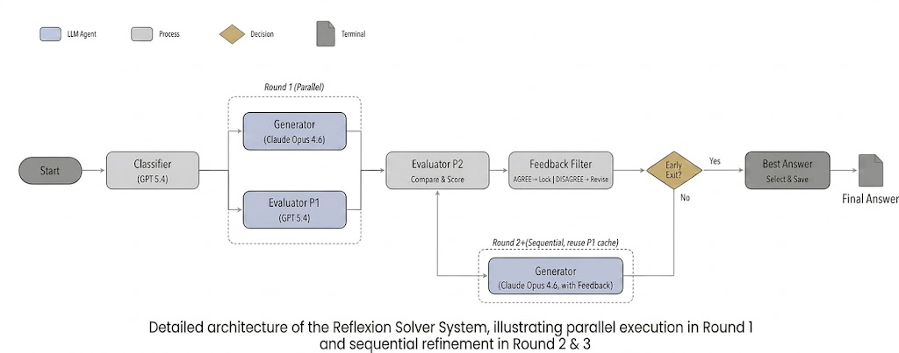

# KAKAO AI TOP 100 Solver

> Codename: **KAKAO Roastery Orchestra**

**Language:** [🇺🇸 English](./README.md) | [🇰🇷 한국어](../../README.md)

A generic Generator-Evaluator loop that automatically solves KAKAO AI TOP 100 problems.

```
Orchestrator → Generator ⇄ Evaluator (feedback loop)
```

> For crawler installation/usage, see [`crawler/README.md`](../../crawler/README.md).

---

## Architecture



- **Orchestrator** — runs the Generator↔Evaluator loop, tracks best score, submits best round
- **Generator** — reads the problem and produces a solution
- **Evaluator** — independently grades answers (No interaction with Generator)

## Prerequisites

- [Claude Code CLI](https://docs.claude.com/claude-code) (`claude` installed and logged in)
- A `workspace/{slug}/` directory populated by the crawler (see `crawler/README.md`)

## 1. Install

```bash
git clone <repo> kakao_roastery_orchestra
cd kakao_roastery_orchestra

# Claude Code auth (one-time)
claude login
```

## 2. Solve a single problem

```bash
cd kakao_roastery_orchestra/workspace/{slug}
claude -p "$(cat prompt.md)" --dangerously-skip-permissions
```

Orchestrator runs the Generator↔Evaluator loop. Max 2 rounds, early-exit at score ≥ 0.85, highest-scoring round selected.

## 3. Solve all problems (optional)

```bash
cd kakao_roastery_orchestra

# Sequential (safe)
for dir in workspace/*/; do
  [ -f "$dir/prompt.md" ] || continue
  (cd "$dir" && claude -p "$(cat prompt.md)" --dangerously-skip-permissions)
done

# Parallel (not recommended — resource / quota pressure)
for dir in workspace/*/; do
  [ -f "$dir/prompt.md" ] || continue
  (cd "$dir" && claude -p "$(cat prompt.md)" --dangerously-skip-permissions) &
done
wait
```

## 4. Check results

```bash
# Best answer
cat workspace/{slug}/rounds/round_*/solution/answer.json

# Evaluation report
cat workspace/{slug}/rounds/round_*/evaluation/report.md
```

## Directory Layout

```
kakao_roastery_orchestra/
├── agents/                 # generator.md, evaluator.md, orchestrator.md (agent specs)
├── config/                 # evaluation_checklists.md, problem_taxonomy.md
├── crawler/                # problem crawler (see crawler/README.md)
├── docs/                   # architecture.md, en/README.md
└── workspace/              # per-problem run dirs
    └── {slug}/
        ├── prompt.md
        ├── problem/        # description.md, questions.md, files/
        └── rounds/round_N/
            ├── solution/answer.json
            └── evaluation/report.md
```

## Problem Types

Per [`config/problem_taxonomy.md`](../../config/problem_taxonomy.md). Generator/Evaluator self-classify problems before solving.

| Type | Description | Trigger | Tools |
|---|---|---|---|
| **TYPE_A** | Data analysis | Large JSON/CSV/TXT + aggregate/classify/predict | pandas, numpy, scikit-learn |
| **TYPE_B** | Code interpretation/execution | DSL spec or obfuscated code | Python runtime |
| **TYPE_C** | Multimedia extraction | Image/video/PDF input | pytesseract, pdfplumber, PyMuPDF |
| **TYPE_D** | Document synthesis | Heterogeneous files + template | docx/xlsx/m4a/pdf parsers |
| **TYPE_E** | Spatial simulation | Coords + collision + simulator | provided `simulator.py`, pygame |

Composite types possible (e.g. A+C: OCR numbers from image → statistics). Apply all relevant verification methods.

## Notes

- **TYPE_C handled by Gemini elsewhere.** This system covers TYPE_A · B · D · E only.
- Mixed types containing TYPE_C (A+C, B+C, D+C) → multimedia extraction step routed externally; remaining steps run here.
